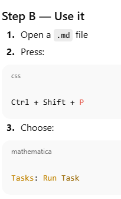

# heading test

** bold** text

[text] http://walkey.ca

---

$\alpha = 0.05$

do:  Ctrl + Shift + V
to see PREVIEW !!!

<!-- @import "[TOC]" {cmd="toc" depthFrom=1 depthTo=6 orderedList=false} -->

IN Terminal:
pandoc Notes/MD_Testing.md -o Notes/MD_Testing.docx

pandoc Notes/MD_Testing.md -o Notes/MD_Testing.pdf

Ctrl + Shift + P

Tasks: Run Task

Preview with:

Ctrl + Shift + V

HTML-style comments:

These are ignored in previews, Word, and PDF.
<!-- This is a comment -->
<!-- TODO: refine analysis section -->
✔ Works everywhere
✔ Pandoc-safe
✔ Invisible in exports
✔ Best for notes-to-self
If it starts with <!-- and ends with -->, it’s a real Markdown comment.
👉 Use this 90% of the time.